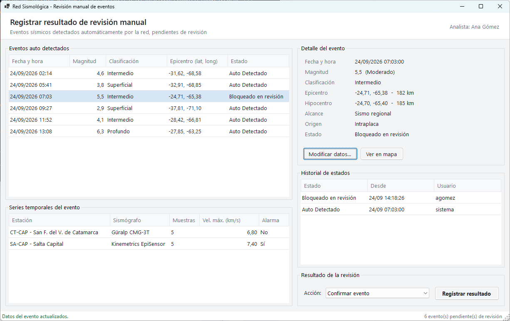
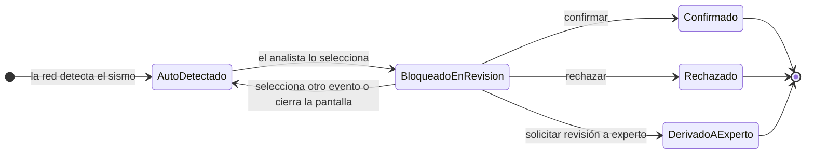
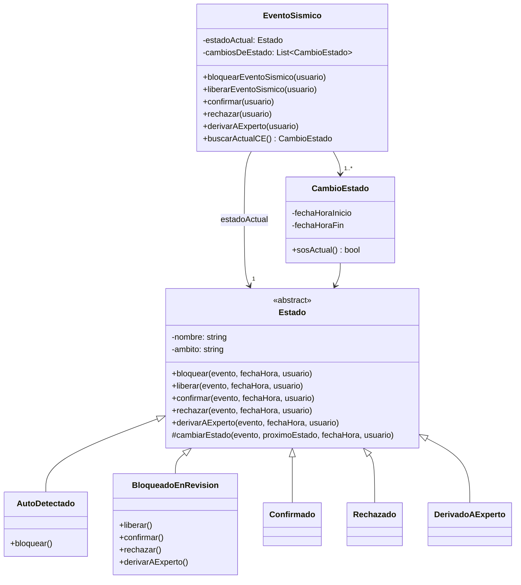
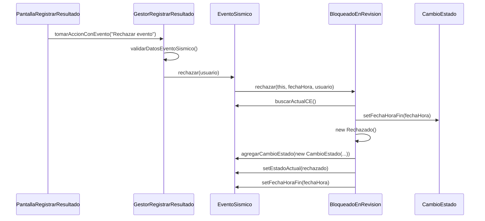
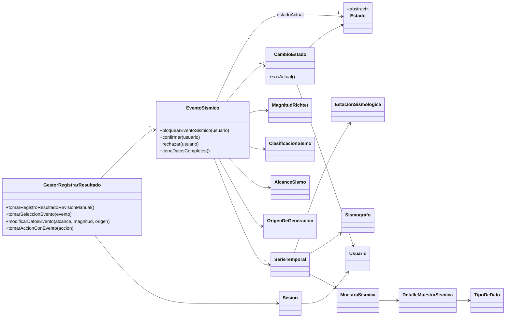

<div align="center">

# Red Sismológica · Revisión manual de eventos

**Aplicación de escritorio para que los analistas de una red sismológica revisen los sismos detectados automáticamente y registren el resultado: confirmar, rechazar o derivar a un experto.**

[](https://github.com/Alelavini/Sismografo/actions/workflows/ci.yml)


<br />



</div>

---

## 🎯 Sobre el trabajo

Trabajo práctico de la materia **Diseño de Sistemas de Información** (UTN - Facultad Regional Córdoba). Su objetivo central fue **aplicar el patrón de diseño State (GoF)** para modelar el ciclo de vida de un evento sísmico dentro del caso de uso *"Registrar resultado de revisión manual"*.

En lugar de representar el estado como un texto y resolver las transiciones con condicionales, cada estado es una clase que sabe qué operaciones admite y hacia qué estado lleva cada una. El evento sísmico delega en su estado actual. [Ver cómo está implementado ↓](#-patrón-state)

---

## ⚡ Probarlo

### Opción A: descargar el ejecutable (sin instalar nada)

1. Entrá a **[Releases](https://github.com/Alelavini/Sismografo/releases/latest)** y bajá `RedSismica-win-x64.zip`.
2. Descomprimilo y abrí `RedSismica.exe`.

Es un único `.exe` autocontenido: no hace falta tener .NET instalado.

### Opción B: desde el código (Windows + [.NET SDK 8 o superior](https://dotnet.microsoft.com/download))

```bash
git clone https://github.com/Alelavini/Sismografo.git
cd Sismografo
dotnet run --project src/RedSismica
```

También se puede abrir `RedSismica.sln` en Visual Studio 2022 y presionar <kbd>F5</kbd>.

> La aplicación arranca con una sesión de analista y un conjunto de eventos simulados, registrados por estaciones ubicadas en localidades de Cuyo, el NOA y la Patagonia, así que se puede recorrer el caso de uso completo de inmediato.

---

## 🧭 Qué hace

Implementa el caso de uso **"Registrar resultado de revisión manual"** de un sistema de gestión para una red sismológica:

1. Lista los **eventos auto detectados** pendientes de revisión, ordenados por fecha y hora de ocurrencia.
2. Al seleccionar uno, el evento queda **bloqueado en revisión** para que ningún otro analista lo tome en paralelo. Si se elige otro, el anterior se libera.
3. Muestra el **detalle del evento**: magnitud y su descripción en la escala de Richter, clasificación por profundidad, epicentro, hipocentro, alcance y origen de generación.
4. Muestra las **series temporales** registradas por cada estación sismológica y sismógrafo, con la velocidad de onda máxima y si se superó el umbral de alarma.
5. Permite **ver el epicentro en un mapa** (OpenStreetMap) y **modificar los datos** del evento (magnitud, alcance, origen).
6. Valida que el evento tenga los datos completos y **registra el resultado**. Cada cambio de estado queda en el **historial** con la fecha y el usuario responsable (la detección inicial figura a nombre del sistema).

### Ciclo de vida de un evento



---

## 🧩 Patrón State

### El problema

Un evento sísmico pasa por varios estados, y **qué se puede hacer con él depende del estado en que está**: un evento auto detectado se puede bloquear para revisarlo, pero no confirmar; uno bloqueado se puede confirmar, rechazar, derivar o liberar; y uno ya confirmado no admite ningún cambio. Resolverlo con un atributo de texto y cadenas de `if` desparrama esas reglas por todo el código y permite transiciones inválidas.

### La solución

| Rol del patrón | Clase |
|----------------|-------|
| **Context** | `EventoSismico`: conoce su estado actual y le delega cada operación |
| **State** (abstracto) | `Estado`: declara todas las transiciones y, por defecto, las rechaza lanzando `TransicionInvalidaException` |
| **Concrete States** | `AutoDetectado`, `BloqueadoEnRevision`, `Confirmado`, `Rechazado`, `DerivadoAExperto`: cada uno sobrescribe sólo las transiciones válidas desde sí mismo |

Cada estado concreto, al ejecutar una transición, **cierra el `CambioEstado` vigente, registra uno nuevo** con la fecha y el analista responsable, y **deja al evento en el próximo estado**. Así el historial siempre tiene un único cambio de estado vigente, y agregar un estado nuevo no requiere modificar los existentes (principio abierto/cerrado).



### Ejemplo: el analista rechaza un evento



Si se intenta una transición que el estado actual no admite (por ejemplo, confirmar un evento que todavía no fue bloqueado para revisión), la clase base `Estado` lanza `TransicionInvalidaException` y el evento queda sin cambios.

---

## 🏗 Arquitectura

Además del patrón State, la aplicación sigue la separación **Pantalla / Gestor / Entidades** (Boundary-Control-Entity):

- **`PantallaRegistrarResultado`** (boundary): sólo presenta datos y captura las acciones del analista. No contiene reglas de negocio.
- **`GestorRegistrarResultado`** (control, patrón GRASP *Controlador*): coordina el caso de uso. Filtra y ordena eventos, bloquea y libera, valida y registra el resultado.
- **Entidades de dominio** (patrón GRASP *Experto*): encapsulan las reglas. `MagnitudRichter` deriva su descripción del valor y `ClasificacionSismo` se calcula a partir de la profundidad del hipocentro.



### Estructura

```
Sismografo/
├── src/RedSismica/
│   ├── Dominio/                  Entidades: EventoSismico, SerieTemporal, CambioEstado...
│   │   └── Estados/              Patrón State: Estado (abstracto) y los estados concretos
│   ├── Interfaz/                 Pantalla principal y diálogo de modificación
│   ├── GestorRegistrarResultado.cs   Controlador del caso de uso
│   ├── DatosDePrueba.cs          Eventos, estaciones y sismógrafos simulados
│   └── Program.cs
├── tests/RedSismica.Tests/       Tests unitarios (xUnit)
└── .github/workflows/            CI y publicación automática del ejecutable
```

---

## 🧪 Tests

```bash
dotnet test
```

La suite tiene dos partes:

- **Patrón State** (`EstadosTests`): cada transición válida lleva al estado concreto correcto y cierra el cambio de estado anterior; las transiciones inválidas desde cada estado lanzan `TransicionInvalidaException` sin modificar el evento; los estados finales no admiten cambios.
- **Caso de uso** (`GestorRegistrarResultadoTests`): filtrado y orden de eventos, bloqueo y liberación al cambiar de selección, registro de cada resultado, historial, validación de datos incompletos, acciones inválidas y clasificación por profundidad.

En cada *push*, **GitHub Actions** compila la solución y corre los tests. Al publicar un tag `v*`, otro workflow genera el `.exe` autocontenido y lo adjunta a un Release.

---

## 🛠 Stack

| | |
|---|---|
| **Lenguaje** | C# 12 con *nullable reference types* |
| **Plataforma** | .NET 8 (LTS) |
| **Interfaz** | Windows Forms |
| **Tests** | xUnit |
| **CI/CD** | GitHub Actions: build, tests y publicación de un ejecutable *single-file* |

---

## 👤 Autor

**Alejandro Lavini**

[](https://github.com/Alelavini)

<div align="center">
<sub>Distribuido bajo licencia <a href="LICENSE">MIT</a>.</sub>
</div>
